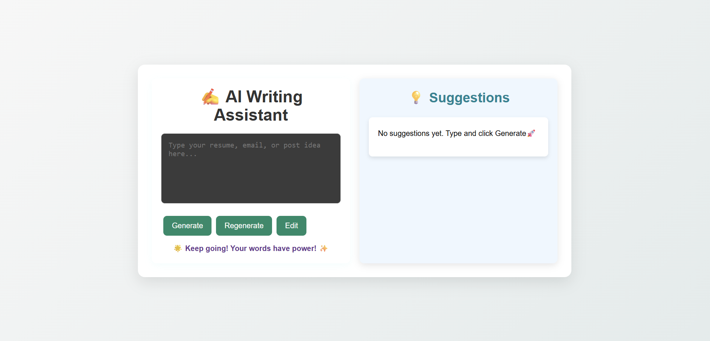
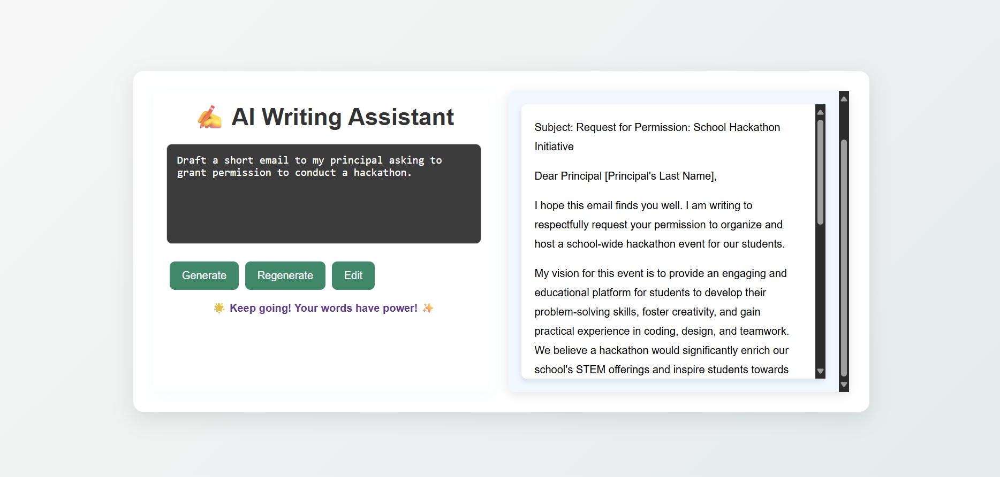

# Gemini Style & Tone Assistant 

A **Flask + React web assistant** that helps users draft or refine written content in various formats (essays, professional emails, personal letters, social media captions) using the **Gemini API**.  

The assistant focuses on **tone, clarity, and style**, delivering polished text without extra commentary.

---

##  Project Overview / Demo

  
*Chat Interface*

  
*Example: drafting an email with professional tone.*

---

##  How It Works
1. **User Input** - User enters a prompt in the React frontend.  
2. **API Call** - The frontend sends a POST request to the Flask `/generate` endpoint.  
3. **Gemini API** - Flask calls `gemini-2.5-flash` with a fixed system prompt to ensure tone and style compliance.  
4. **Processed Output** - The assistant returns refined text suggestions.  
5. **Frontend Display** - React displays the results to the user.  

---

## ⚙️ Tech Stack
- **Frontend:** React.js  
- **Backend:** Flask + Flask-CORS  
- **AI Model:** Google Gemini (`gemini-2.5-flash`)  

